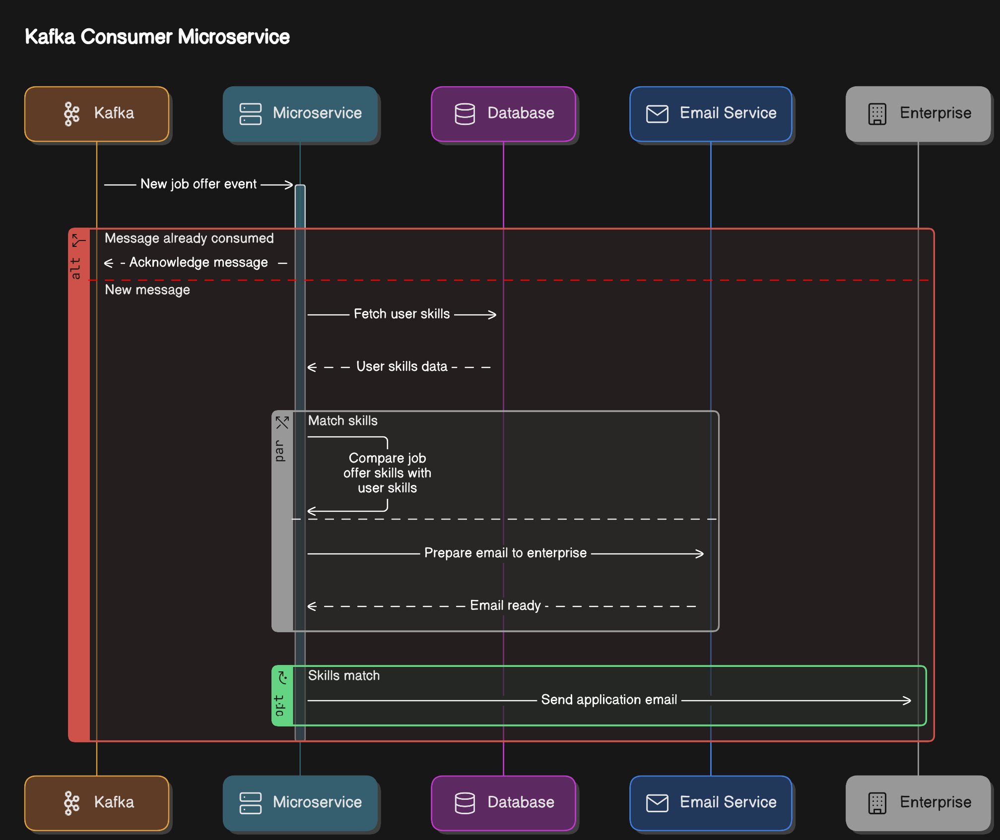

# Job Offer Consumer Kafka Project

This project is a Kafka consumer that consumes job offer messages and checks if the message is new or has been already consumed. If new, it gets candidature skills from a MySQL database and matches the job offer skills with candidature. If the candidature matches the job offer, it sends a job apply email to the enterprise.

## Project Structure

The project consists of the following directories:

* `src/`: contains the Java source code for the project
* `docker/`: contains the Dockerfile and configuration files for building and running the project in a Docker container

## Setup

To set up the project, follow these steps:

1. Build the Docker image by running the command `docker build -t joboffer-consumer .` in the root directory of the project.
2. Run the Docker container by running the command `docker run -p 8080:8080 joboffer-consumer`.
3. Configure the MySQL database connection settings in the `application.properties` file.

## Usage

To use the project, follow these steps:

1. Send a job offer message to the Kafka topic.
2. The consumer will consume the message and check if it is new or has been already consumed.
3. If new, the consumer will get candidature skills from the MySQL database and match the job offer skills with candidature.
4. If the candidature matches the job offer, the consumer will send a job apply email to the enterprise.

## Schema

The project uses the following schema:

## Consumer Workflow

The consumer workflow is as follows:

1. Consume job offer message from Kafka topic
2. Check if message is new or has been already consumed
3. If new, get candidature skills from MySQL database
4. Match job offer skills with candidature
5. If candidature matches job offer, send job apply email to enterprise

## Troubleshooting

If you encounter any issues with the project, refer to the `TROUBLESHOOTING.md` file for troubleshooting guides.
